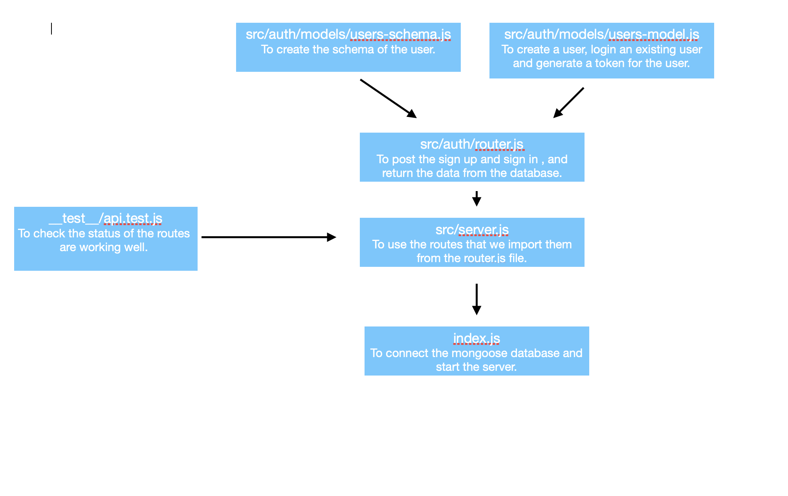

# auth-server

## Author: Abdulrahman AL-Janabi
## Project: Authentication Server

## Lab 11

### Description of today lab
**Today we create a login system with base-64, bcrypt and authenticate the user.**

### Pull Request
- [PR1](https://github.com/Janabi/auth-server/pull/1)

### Dependencies
- base-64
- bcrypt
- express
- @code-fellows/supergoose
- jest
- jest-cli
- dotenv
- nodemon
- jsonwebtoken

### How to start the server
- node index.js
- nodemon / npx nodemon

### What should I urn on the terminal or postman?
- POST: http://localhost:3000/signup
- POST: http://localhost:3000/signin
- GET: http://localhost:3000/users

### UML
